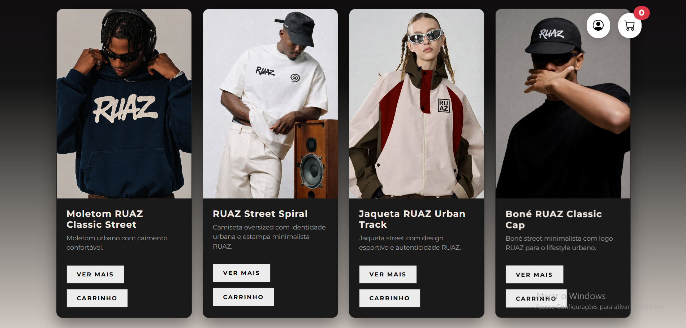
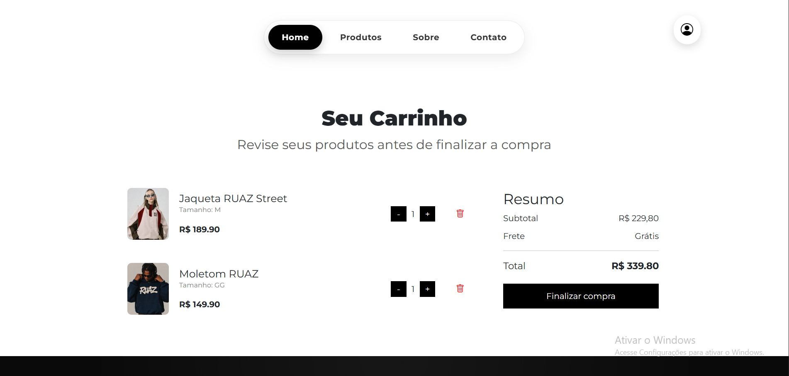
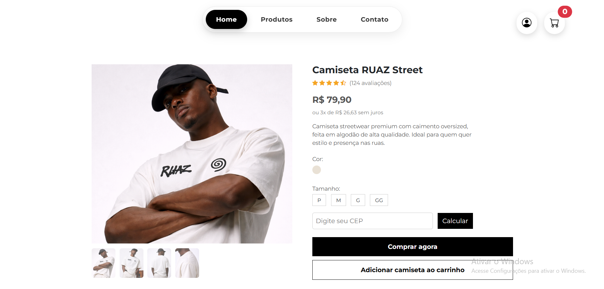

# 🚧 RUAZ

RUAZ é um projeto front-end de e-commerce com foco em streetwear, desenvolvido para oferecer uma experiência moderna, limpa e imersiva ao usuário.

---

## 🔥 Visão Geral

Este projeto foi construído do zero com o objetivo de unir **identidade de marca, design e desenvolvimento front-end** em uma única experiência.

O RUAZ não é apenas um layout — é um conceito de como uma marca streetwear deve se apresentar no digital.

---

## ✨ Funcionalidades

- 🛒 Carrinho de compras dinâmico (adição e remoção de itens)
- ✅ Validação de formulários
- ⚡ Navegação fluida e intuitiva
- 🎨 Interface moderna com identidade visual forte
- 🖼️ Galeria de imagens rica

---

## 🛠️ Tecnologias

- HTML5
- CSS3
- JavaScript (Vanilla)
- Bootstrap

---

## 🎯 Foco do Projeto

Este projeto foi desenvolvido com foco em:

- Experiência do Usuário (UX)
- Interface do Usuário (UI)
- Identidade Visual
- Estruturação Front-end

---

## 🚀 Próximos Passos

- Integração com backend
- Autenticação de usuários
- Persistência de dados
- Sistema de checkout

---

## 📸 Preview

---

## 🔗 Demonstração

LinkedIn: 

---

## 💭 Considerações Finais

Este projeto representa consistência, aprendizado e evolução ao longo do processo de desenvolvimento.

---

## 👊 Autor

Desenvolvido por Gabriel Costa Domiciano.
